<picture>
  <source media="(prefers-color-scheme: dark)" srcset="https://cdn.jsdelivr.net/gh/mrLexx/assets@main/logo/logo-mark-dark.svg">
  <source media="(prefers-color-scheme: light)" srcset="https://cdn.jsdelivr.net/gh/mrLexx/assets@main/logo/logo-mark-light.svg">
  
</picture>

# mrLexx

Backend / DevOps engineer &nbsp;·&nbsp; Go &nbsp;·&nbsp; PHP &nbsp;·&nbsp; CI/CD

## 💻 Tech Stack

## 👨🏻‍💻 Currently working on

- [go-cache](https://github.com/mrLexx/go-cache) — caching library in Go
- Building a cache server, a Memcached analog — written in Go, protocol-compatible with Memcached, built on top of my own go-cache library
- CI/CD pipelines on GitHub Actions for Go projects (reusable composite actions)
- ETL pipelines in Go
- DevOps routine automation: Go/Bash scripting
- PHP-FPM Docker images for PHP 8.1–8.5 — a family of `docker-php-fpm-*` repos ([make tool](https://github.com/mrLexx/docker-php-fpm-make), [8.4](https://github.com/mrLexx/docker-php-fpm-8.4), [8.5](https://github.com/mrLexx/docker-php-fpm-8.5), plus forked base images for 8.1–8.3)

## 📌 Pinned Projects

[go-cache](https://github.com/mrLexx/go-cache)  
[go-concurrency-lab](https://github.com/mrLexx/go-concurrency-lab)  
[go-etl-pipeline-lab](https://github.com/mrLexx/go-etl-pipeline-lab)

[devilbox-environment](https://github.com/mrLexx/devilbox-environment)
[docker-php-fpm-make](https://github.com/mrLexx/docker-php-fpm-make)
[docker-php-fpm-8.5](https://github.com/mrLexx/docker-php-fpm-8.5)
[docker-php-fpm-8.4](https://github.com/mrLexx/docker-php-fpm-8.4)

